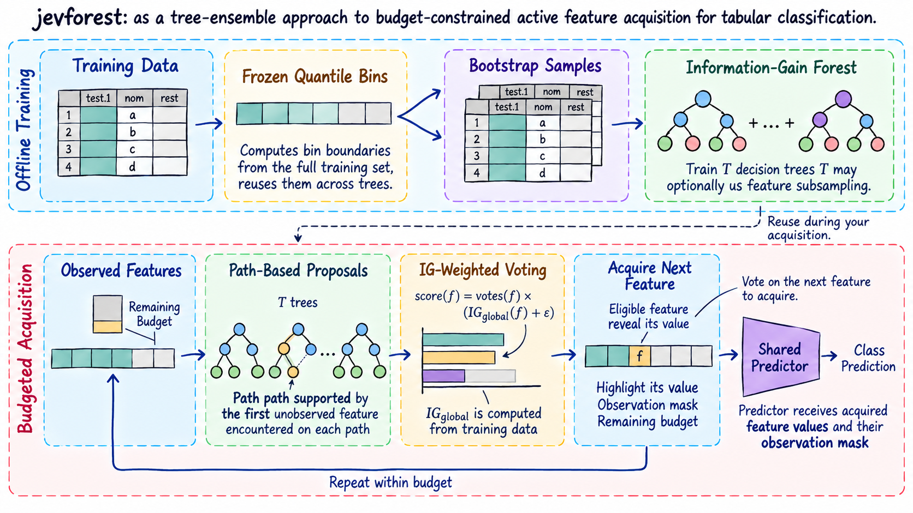
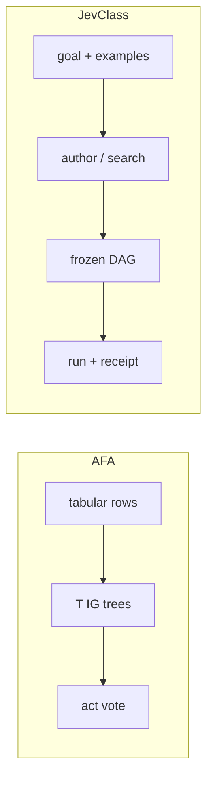

<div align="center">

<h1>jevforest</h1>

**Bagged IG 树对下一个预算问题投票；一句话目标可冻结成 JevClass DAG。**

中文 | [English](README_EN.md)

[](https://www.python.org/downloads/)
[](./LICENSE)

[快速上手](#五分钟上手) · [CLI](#cli) · [评测结果](#评测结果) · [环境](#环境)

</div>

项目包含两条路径：表格 AFA 在预算内逐步获取特征；JevClass 从目标与少量示例生成并执行冻结 DAG。



图示为**表格 AFA 分支**：在预算内循环获取特征，停止时将已获取的特征值和观测掩码交给共享预测器。JevClass 是另一条目标驱动的 DAG 路径，未在此图中展示。[查看原图](assets/jevforest-overview.png)

<details>
<summary>展开两条路径的文字与流程图</summary>

```text
表格 AFA                         JevClass
FeatureTable / 行                goal + 0–5 示例
        ↓ 冻结 bins                     ↓ author-once / search
   T 棵 bootstrap IG 树           v2 spec（Jev noul/choice/score）
        ↓ path-walk 投票                ↓ freeze
   下一个要买的特征               run → decision / abstain + receipt
```



</details>

AFA 依赖 sibling [`jevtree`](https://github.com/qzqdz/jevtree)。`jevforest decide` 仍未实现。`eval-synth` 默认 stub，Acc 只说明流水线自洽，不是 live Jev 质量。

---

## 五分钟上手

```bash
python3 -m venv .venv && source .venv/bin/activate
pip install -e ../jevtree
pip install -e .

./scripts/quickstart.sh
python -m jevforest eval-afa --config configs/eval_cube_forest.json
```

一句话生成并跑一张工单（无需 API）：

```bash
python -m jevforest author --goal "Route support tickets to billing technical sales" --out results/authored.json
python -m jevforest run --jevclass results/authored.json --input '{"text":"Please refund the payout"}'
python -m jevforest eval-synth --task-dir examples/tasks/tickets --shot 0
```

Live Jev：`.env` 里填 `OPENROUTER_API_KEY`，命令加 `--provider live`。

## CLI

```bash
jevforest eval-afa --config configs/…   # 硬预算 AFA
jevforest author --goal "…"             # 一句话 → JevClass（默认 unverified）
jevforest run --jevclass … --input …    # 执行冻结 DAG
jevforest eval-synth --task-dir …       # 封存 few-shot 评测
jevforest version
jevforest decide                        # 未实现
```

## 评测结果

MiniBooNE 上 forest 从 budget 10 起超过 jevtree Disc / IG_static；Acc@5 仍落后 Disc。Cube Acc@3 饱和，不作方法证据。样例：[`results/sample/cube_eval_summary.json`](results/sample/cube_eval_summary.json)。

### Live Jev · 封存工单测试（n=8，shot=0）

Provider `~typesafe/jev-latest`（实测 `typesafe/jev-1.13-20260917`）。一句话 `author_once` 从 goal 抽出标签并冻结 DAG，再在 **未见过的 test.jsonl** 上跑。n 很小，只证明这条任务上 live Jev 能跑通，不是大规模泛化。

| Method | Acc | Coverage | n |
|--------|----:|---------:|--:|
| `direct_choice` | 1.000 | 1.000 | 8 |
| `author_once`（goal→spec） | 1.000 | 1.000 | 8 |

摘要：[`results/sample/n4_live_ticket_summary.json`](results/sample/n4_live_ticket_summary.json)。Search 未在 live 上计费。

### MiniBooNE · Acc@budget（seed 0，logistic_impute）

| Budget | Forest (`ig_weighted`) | Disc | IG_static | Random |
|-------:|-----------------------:|-----:|----------:|-------:|
| 5 | 0.798 | **0.824** | 0.814 | 0.746 |
| 10 | **0.856** | 0.820 | 0.822 | 0.766 |
| 20 | **0.878** | 0.814 | 0.822 | 0.760 |
| 40 | **0.894** | 0.828 | 0.814 | 0.800 |

### Cube · Acc@3

| Policy | Acc@3 |
|--------|------:|
| `ig_forest` | 1.000 |
| jevtree `ig_static` | 1.000 |
| jevtree `sequential` | 1.000 |
| jevtree `random` | 0.766 |

## 环境

Python ≥ 3.11。AFA 评测不需要 LLM。Jev 客户端与 `--provider live` 读取 `OPENROUTER_API_KEY`（默认 `~typesafe/jev-latest`）。

更多脚本见 [`examples/README.md`](examples/README.md)。
