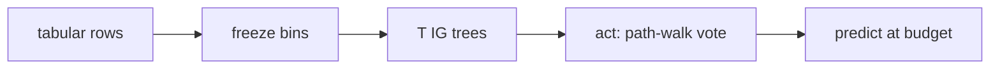

# jevforest

语言: 中文 | [English](README_EN.md)

[](https://www.python.org/downloads/)
[](#)
[](./LICENSE)

**Bagged IG 树对「下一个预算问题」投票，而不只对 y 投票。**

```text
FeatureTable / 表格行
        ↓ 全训练集冻结 quantile bins
   T 棵 bootstrap IG 树
        ↓ act()：path-walk + ig_weighted 投票
   下一个要买的特征
        ↓ 预算用尽
      predict() + 可选 trace
```



依赖 sibling [`jevtree`](https://github.com/qzqdz/jevtree) 的协议与 predictor。`jevforest decide` 尚未实现。

---

## 五分钟上手

```bash
python3 -m venv .venv && source .venv/bin/activate
pip install -e ../jevtree
pip install -e .

# 一键 cube 烟雾
./scripts/quickstart.sh

# 或手动评测
python -m jevforest eval-afa --config configs/eval_cube_forest.json
```

MiniBooNE 公平表（与 jevtree 同一 `logistic_impute`）：

```bash
python -m jevforest eval-afa --config configs/eval_miniboone_forest_logistic.json
```

多 seed 抽样：

```bash
python scripts/sample_reliability.py --dataset miniboone --seeds 0,1,2
```

产物在 `results/<dataset>_ig_forest_<timestamp>/`：

| 文件 | 内容 |
|------|------|
| `summary.json` | Acc / F1 @ budget |
| `episodes.jsonl` | 逐条获取序列 |

## CLI

```bash
jevforest eval-afa --config configs/…   # 硬预算 AFA
jevforest version
jevforest decide                        # 未实现
```

## 评测结果

MiniBooNE 上 forest 从 budget 10 起超过 jevtree Disc / IG_static；Acc@5 仍落后 Disc。Cube Acc@3 饱和，不作方法证据。完整表、CI 与消融见 [`docs/RESULTS.md`](docs/RESULTS.md)。

### MiniBooNE · Acc@budget（seed 0，logistic_impute）

| Budget | Forest (`ig_weighted`) | Disc | IG_static | Random |
|-------:|-----------------------:|-----:|----------:|-------:|
| 5 | 0.798 | **0.824** | 0.814 | 0.746 |
| 10 | **0.856** | 0.820 | 0.822 | 0.766 |
| 20 | **0.878** | 0.814 | 0.822 | 0.760 |
| 40 | **0.894** | 0.828 | 0.814 | 0.800 |

### Cube · Acc@3

| Policy | Acc@3 |
|--------|------:|
| `ig_forest` | 1.000 |
| jevtree `ig_static` | 1.000 |
| jevtree `sequential` | 1.000 |
| jevtree `random` | 0.766 |

## 环境

Python ≥ 3.11。评测不需要 LLM。可选 Jev 客户端读取 `.env` 中的 `OPENROUTER_API_KEY`（模型默认 `~typesafe/jev-latest`），只做类型化 noul / choice / score，不替代 `eval-afa`。

更多脚本说明见 [`examples/README.md`](examples/README.md)。
