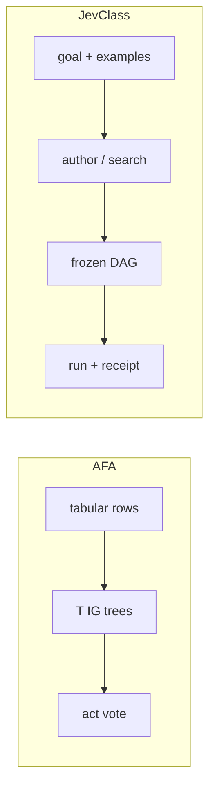

<div align="center">

<h1>jevforest</h1>

**Bagged IG trees vote on the next budgeted question; a one-sentence goal freezes to a JevClass DAG.**

[中文](README.md) | English

[](https://www.python.org/downloads/)
[](./LICENSE)

[Quickstart](#five-minute-quickstart) · [CLI](#cli) · [Benchmarks](#benchmark-results) · [Environment](#environment)

</div>

The project has two paths: tabular AFA acquires features within a budget; JevClass authors and executes a frozen DAG from a goal and a few examples.


The figure shows the **tabular AFA branch**: acquire features within budget, then pass acquired values and the observation mask to a shared predictor when acquisition stops. JevClass is a separate goal-driven DAG path and is not shown here. [View full-size image](assets/jevforest-overview.png)

<details>
<summary>Expand the text and flow diagrams for both paths</summary>

```text
tabular AFA                      JevClass
FeatureTable / rows              goal + 0–5 examples
        ↓ freeze bins                   ↓ author-once / search
   T bootstrap IG trees          v2 spec (Jev noul/choice/score)
        ↓ path-walk vote                ↓ freeze
   next feature to buy           run → decision / abstain + receipt
```



</details>

AFA needs sibling [`jevtree`](https://github.com/qzqdz/jevtree). `jevforest decide` is not implemented. `eval-synth` defaults to a stub; those accuracies are pipeline consistency, not live Jev quality.

---

## Five-minute quickstart

```bash
python3 -m venv .venv && source .venv/bin/activate
pip install -e ../jevtree
pip install -e .

./scripts/quickstart.sh
python -m jevforest eval-afa --config configs/eval_cube_forest.json
```

Author and run one ticket (no API key):

```bash
python -m jevforest author --goal "Route support tickets to billing technical sales" --out results/authored.json
python -m jevforest run --jevclass results/authored.json --input '{"text":"Please refund the payout"}'
python -m jevforest eval-synth --task-dir examples/tasks/tickets --shot 0
```

Live Jev: set `OPENROUTER_API_KEY` in `.env` and pass `--provider live`.

## CLI

```bash
jevforest eval-afa --config configs/…   # hard-budget AFA
jevforest author --goal "…"             # one sentence → JevClass (default unverified)
jevforest run --jevclass … --input …    # execute a frozen DAG
jevforest eval-synth --task-dir …       # sealed few-shot eval
jevforest version
jevforest decide                        # not implemented
```

## Benchmark results

On MiniBooNE, forest leads jevtree Disc / IG_static from budget 10; Acc@5 still trails Disc. Cube Acc@3 is saturated. Sample: [`results/sample/cube_eval_summary.json`](results/sample/cube_eval_summary.json).

### Live Jev · sealed ticket test (n=8, shot=0)

Provider `~typesafe/jev-latest` (ran as `typesafe/jev-1.13-20260917`). `author_once` builds a DAG from the goal sentence, then scores the **held-out** `test.jsonl`. n is tiny; this is a live smoke, not a large-task claim.

| Method | Acc | Coverage | n |
|--------|----:|---------:|--:|
| `direct_choice` | 1.000 | 1.000 | 8 |
| `author_once` (goal→spec) | 1.000 | 1.000 | 8 |

Summary: [`results/sample/n4_live_ticket_summary.json`](results/sample/n4_live_ticket_summary.json). Search was not billed on live Jev.

### MiniBooNE · Acc@budget (seed 0, logistic_impute)

| Budget | Forest (`ig_weighted`) | Disc | IG_static | Random |
|-------:|-----------------------:|-----:|----------:|-------:|
| 5 | 0.798 | **0.824** | 0.814 | 0.746 |
| 10 | **0.856** | 0.820 | 0.822 | 0.766 |
| 20 | **0.878** | 0.814 | 0.822 | 0.760 |
| 40 | **0.894** | 0.828 | 0.814 | 0.800 |

### Cube · Acc@3

| Policy | Acc@3 |
|--------|------:|
| `ig_forest` | 1.000 |
| jevtree `ig_static` | 1.000 |
| jevtree `sequential` | 1.000 |
| jevtree `random` | 0.766 |

## Environment

Python ≥ 3.11. AFA eval needs no LLM. The Jev client and `--provider live` read `OPENROUTER_API_KEY` (default `~typesafe/jev-latest`).

More scripts: [`examples/README.md`](examples/README.md).
